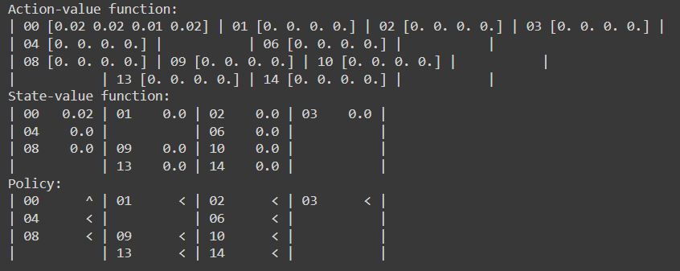

# MONTE CARLO CONTROL ALGORITHM

## AIM

The aim is to use Monte Carlo Control in a specific environment to learn an optimal policy, estimate state-action values, iteratively improve the policy, and optimize decision-making through a functional reinforcement learning algorithm.

## PROBLEM STATEMENT

Monte Carlo Control is a reinforcement learning method, to figure out the best actions for different situations in an environment. The provided code is meant to do this, but it's currently having issues with variables and functions.

## MONTE CARLO CONTROL ALGORITHM

#### Step 1:

Initialize Q-values, state-value function, and the policy.

#### Step 2:

Interact with the environment to collect episodes using the current policy.

#### Step 3:

For each time step within episodes, calculate returns (cumulative rewards) and update Q-values.

#### Step 4:

Update the policy based on the improved Q-values.

#### Step 5:

Repeat steps 2-4 for a specified number of episodes or until convergence.

#### Step 6:

Return the optimal Q-values, state-value function, and policy.

## MONTE CARLO CONTROL FUNCTION

```
Name: Senthil Kumar S
Reg no: 212221230091
```

```python
from tqdm import tqdm
def mc_control (env, gamma = 1.0,
                init_alpha = 0.5,min_alpha = 0.01, alpha_decay_ratio = 0.5,
                init_epsilon = 1.0, min_epsilon = 0.1, epsilon_decay_ratio = 0.9,
                n_episodes = 3000, max_steps = 200, first_visit = True):
  nS, nA = env.observation_space.n, env.action_space.n
  discounts = np.logspace(0, max_steps,num=max_steps,base=gamma,endpoint=False)
  alphas = decay_schedule(init_alpha,min_alpha,alpha_decay_ratio,n_episodes)
  epsilons = decay_schedule(init_epsilon,min_epsilon,epsilon_decay_ratio,n_episodes)
  pi_track = []
  Q = np.zeros((nS, nA))
  Q_track = np.zeros((n_episodes,nS,nA))
  select_action = lambda state, Q, epsilon: np.argmax(Q[state]) if np.random.random() > epsilon else np.random.randint(len(Q[state]))
  for e in tqdm(range(n_episodes), leave = False):
    trajectory = generate_trajectory(select_action,Q,epsilons[e],env,max_steps)
    visited = [[0]*nA for _ in range(nS)]


    for t, (state,action,reward,_,_) in enumerate(trajectory):
      state = int(state)
      action = int(action)
      #print(visited[state][action])
      if visited[state][action] and first_visit:
        continue
      visited[state][action] = 1
      n_steps = len(trajectory[t:])
      G = np.sum(discounts[:n_steps] * trajectory[t:,2])
      Q[state][action] = Q[state][action] + alphas[e] * (G - Q[state][action])
    Q_track[e] = Q
    pi_track.append(np.argmax(Q, axis=1))
  V = np.max(Q, axis=1)
  pi = lambda s: {s:a for s, a in enumerate(np.argmax(Q, axis=1))}[s]

  return Q, V, pi, Q_track, pi_track
```

## OUTPUT:



## RESULT:

Thus the program to use Monte Carlo Control in a specific environment to learn an optimal policy, estimate state-action values, iteratively improve the policy, and optimize decision-making through a functional reinforcement learning algorithm is successfully completed.
